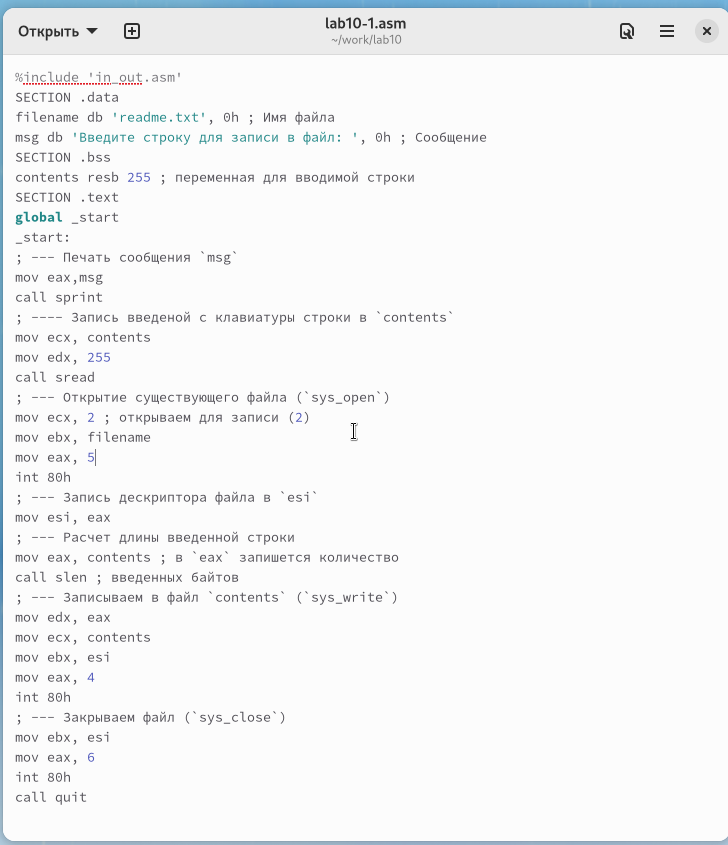
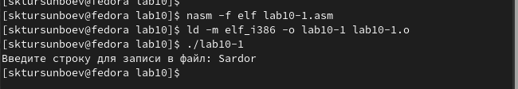
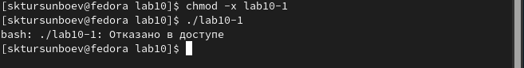
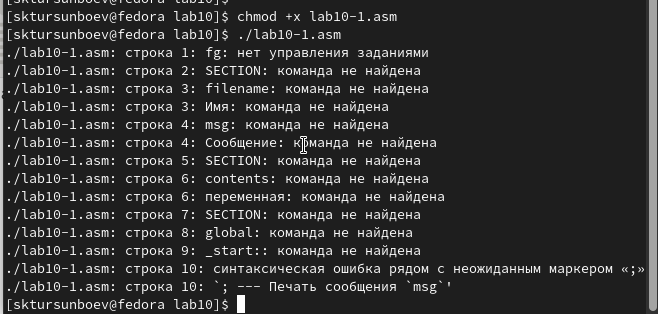
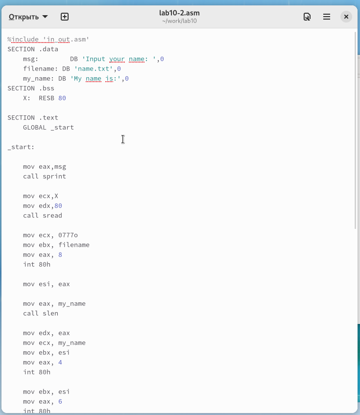
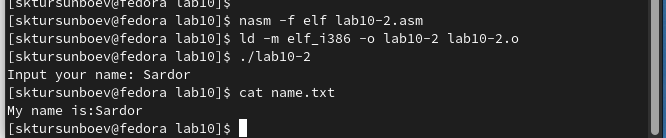

---
## Front matter
title: "Лабораторная работа №10"
subtitle: "Работа с файлами средствами Nasm"
author: "Турсунбоев Сардорбек"

## Generic otions
lang: ru-RU
toc-title: "Содержание"

## Bibliography
bibliography: bib/cite.bib
csl: pandoc/csl/gost-r-7-0-5-2008-numeric.csl

## Pdf output format
toc: true # Table of contents
toc-depth: 2
lof: true # List of figures
lot: true # List of tables
fontsize: 12pt
linestretch: 1.5
papersize: a4
documentclass: scrreprt
## I18n polyglossia
polyglossia-lang:
  name: russian
  options:
	- spelling=modern
	- babelshorthands=true
polyglossia-otherlangs:
  name: english
## I18n babel
babel-lang: russian
babel-otherlangs: english
## Fonts
mainfont: PT Serif
romanfont: PT Serif
sansfont: PT Sans
monofont: PT Mono
mainfontoptions: Ligatures=TeX
romanfontoptions: Ligatures=TeX
sansfontoptions: Ligatures=TeX,Scale=MatchLowercase
monofontoptions: Scale=MatchLowercase,Scale=0.9
## Biblatex
biblatex: true
biblio-style: "gost-numeric"
biblatexoptions:
  - parentracker=true
  - backend=biber
  - hyperref=auto
  - language=auto
  - autolang=other*
  - citestyle=gost-numeric
## Pandoc-crossref LaTeX customization
figureTitle: "Рис."
tableTitle: "Таблица"
listingTitle: "Листинг"
lofTitle: "Список иллюстраций"
lotTitle: "Список таблиц"
lolTitle: "Листинги"
## Misc options
indent: true
header-includes:
  - \usepackage{indentfirst}
  - \usepackage{float} # keep figures where there are in the text
  - \floatplacement{figure}{H} # keep figures where there are in the text
---

# Цель работы

Целью работы является приобретение навыков написания программ для работы с файлами.

# Задание

1. Изучить чтение/запись файлов с помошью ассемблера

2. Рассмотреть пример программы

3. Изучить как работать с правами доступа

4. Выполнить самостоятельное задание

# Выполнение лабораторной работы

Я создал каталог для программ, связанных с лабораторной работой № 10, 
и перешел в него. Затем я создал файлы lab10-1.asm, readme-1.txt и readme-2.txt.

В файл lab10-1.asm я внес текст программы из листинга 10.1 
(Программа записи сообщения в файл). Я сформировал исполняемый файл и 
проверил его работу.

{ #fig:001 width=70%, height=70% }

Эта программа запрашивает ввод строки и перезаписывает ее в файл readme.txt. 
Если файл не существует, введенная строка не будет сохранена.

{ #fig:002 width=70%, height=70% }

Когда я попытался запустить файл lab10-1, он не выполнился, так как у него 
были запрещены права на выполнение во всех трех позициях.

{ #fig:003 width=70%, height=70% }

Затем я использовал команду chmod, чтобы изменить права доступа к файлу 
lab10-1.asm с исходным текстом программы, добавив права на выполнение. 
После этого я попытался выполнить файл.

Файл успешно запустился, и терминал попытался выполнить его содержимое 
как команды командной строки. Однако, так как содержимое файла - это инструкции 
ассемблера, а не команды командной строки, возникли ошибки. Тем не менее, 
если в такой файл добавить команды командной строки, их можно будет выполнить, 
запустив файл.

{ #fig:004 width=70%, height=70% }

Я также установил права доступа к файлам readme в соответствии с вариантом, 
указанным в таблице 10.4. Я проверил правильность выполнения с помощью 
команды ls -l.

Мой вариант 4: ```-w- --- -w-``` и ```001 011 110```

{ #fig:005 width=70%, height=70% }

## Задание для самостоятельной работы

Написал программу работающую по следующему алгоритму:

- Вывод приглашения “Как Вас зовут?”

- ввести с клавиатуры свои фамилию и имя

- создать файл с именем name.txt

- записать в файл сообщение “Меня зовут”

- дописать в файл строку введенную с клавиатуры

- закрыть файл

{ #fig:006 width=70%, height=70% }

{ #fig:007 width=70%, height=70% }

# Выводы

Освоили работy с файлами и правами доступа.